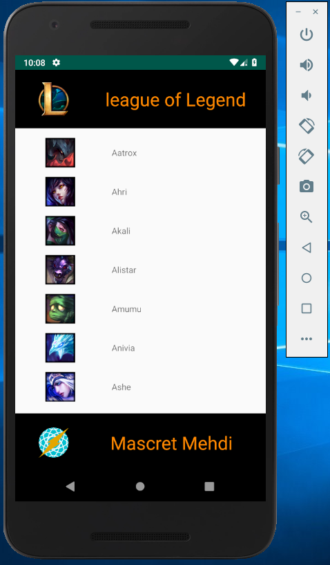
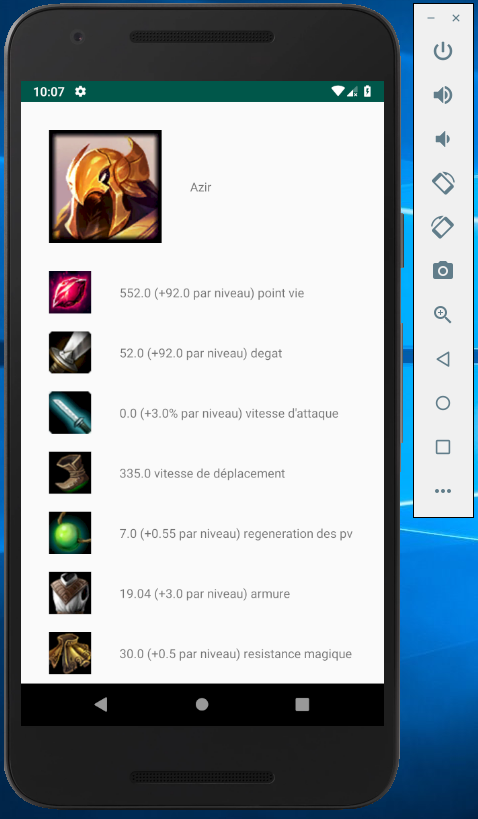
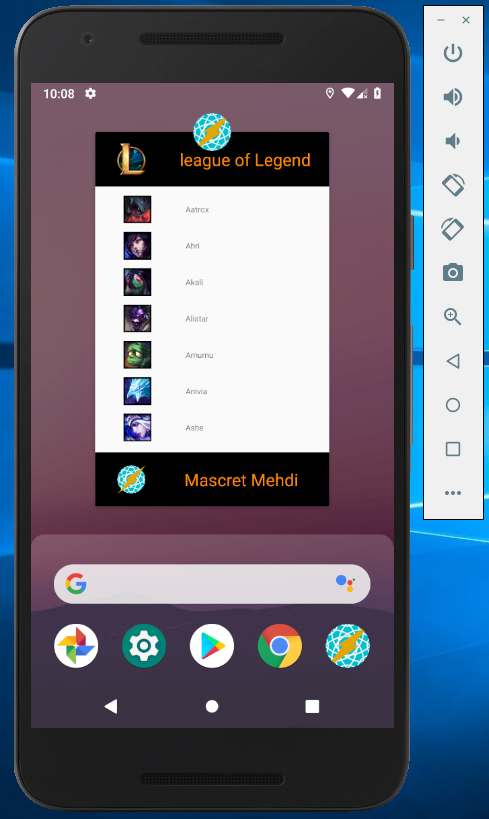
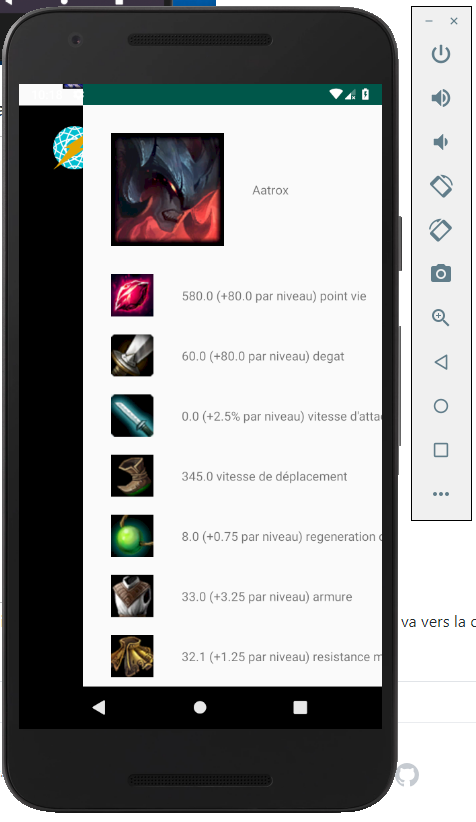

# Projet Mobile 3A

## Fait par

Mascret Mehdi
(3A initial)

## Présentation

Cette application permet d'afficher une liste de personnage de league of legend. La liste n'est pas exhaustive. Elle est crée à partir d'une api liée à mon site internet.

## Consignes respectées :

- Pour une note minimale :
	- Deux écrans : Un écran avec une liste (RecyclerView) et un écran avec un détail de l’item.
	- Appel WebService à une API Rest.
	- Stockage des données en cache.
- Fonctions supplémentaires :	
	- Création d'une API personnalisée (http://rly-chrono.fr/api/League_of_legend/)
	- Création d'une animation

## Programme

### Ecran Home 

### Ecran du détaillez

- Affiche le nom du personnage
- L'image du personnage
- Les stats (dégat, pv, armure ...) quand elles sont détailler sur league of legend le site internet.

### Logo de l'application

### Animation

- Le mainActivity va vers le haut pendant que la secondeActivity va vers la droite
